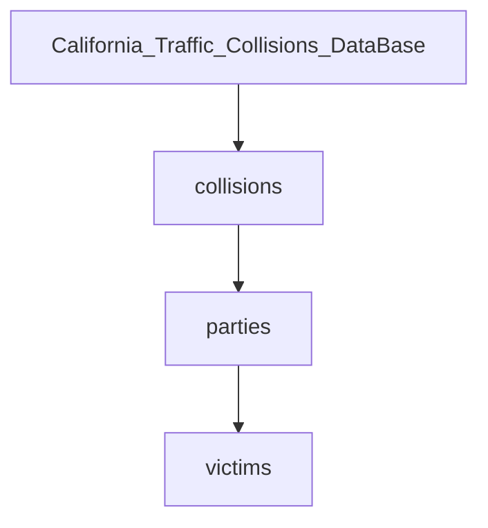
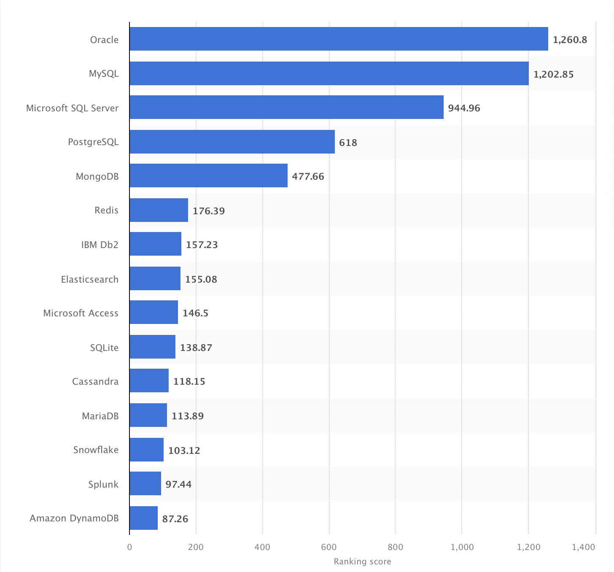

<!-- Tarea 1. Preliminares-->

# 1. Preliminares
### Base de Datos y sus relaciones de manera no estructurada. 

Una *base de datos* es un tipo de tecnología para el almacenamiento de datos. 

>Utilizamos bases de datos como fuente principal de datos, ayudándonos a compartirlos entre las diferentes partes de nuestras aplicaciones.

Los datos comúnmente se describen cómo estructurados o no estructurados, o a veces como semi-estructurados. 

### **Datos Estructurados**
En los datos estructurados -siguiendo un modelo de datos especifico y de tipo de datos-, cada atributo es almacenado en una columna y las instancias de cada entidad se representan como filas. Los datos estructurados son fáciles de consultar con SQL.
### **Datos No Estructurados**
Los datos no estructurados son lo opuesto a los datos estructurados. No hay una estructura, modelo de datos o tipos de datos predeterminados.

Ejemplos de Datos No Estructurados:
>Documentos, correos electrónicos, páginas web, fotos, imágenes, videos y archivos de audio son ejemplos de datos no estructurados. 

## Data set: California Traffic Collision Data from SWITRS

Se trabaja con la base de datos de cada colisión de tránsito reportada desde 2001 hasta el 2020 en el estado de California, Estados Unidos. La base de datos esta compuesta por 3 tablas: 

* collisions: contiene información relacionada al choques, su ubicación, vehículos, entre otros. 
* parties: contiene información sobre las personas involucradas en los choques, como edad, sexo, ebriedad, etc. 
* victims: contiene información relacionada a lesiones de las personas involucradas. 

Se pide analizar la presente base de datos con el propósito de conocer moda, mediana y media de los accidentes por día, por tipo de vehículo, así como visualización de los datos. 

Tabla "collisions"

| Nombre      | Tipo |	
| ----------- | ----------- |	
| case_id| TEXT| 
| jurisdiction| INT| 
| officer_id| TEXT| 
| reporting_district| TEXT| 
| chp_shift| TEXT| 
| population| TEXT| 
| county_city_location| TEXT| 
| county_location| TEXT| 
| special_condition| TEXT| 
| beat_type| TEXT| 
| chp_beat_type| TEXT| 
| city_division_lapd| TEXT| 
| chp_beat_class| TEXT| 
| beat_number| TEXT| 
| primary_road| TEXT| 
| secondary_road| TEXT| 
| distance| REAL| 
| direction| TEXT| 
| intersection| INT| 
| weather_1| TEXT| 
| weather_2| TEXT| 
| state_highway_indicator| INT| 
| caltrans_county| TEXT| 
| caltrans_district| INT| 
| state_route| INT| 
| route_suffix| TEXT| 
| postmile_prefix| TEXT| 
| postmile| REAL| 
| location_type| TEXT| 
| ramp_intersection| TEXT| 
| side_of_highway| TEXT| 
| tow_away| INT| 
| collision_severity| TEXT| 
| killed_victims| INT| 
| injured_victims| INT| 
| party_count| INT| 
| primary_collision_factor| TEXT| 
| pcf_violation_code| TEXT| 
| pcf_violation_category| TEXT| 
| pcf_violation| INT| 
| pcf_violation_subsection| TEXT| 
| hit_and_run| TEXT| 
| type_of_collision| TEXT| 
| motor_vehicle_involved_with| TEXT| 
| pedestrian_action| TEXT| 
| road_surface| TEXT| 
| road_condition_1| TEXT| 
| road_condition_2| TEXT| 
| lighting| TEXT| 
| control_device| TEXT| 
| chp_road_type| TEXT| 
| pedestrian_collision| INT| 
| bicycle_collision| INT| 
| motorcycle_collision| INT| 
| truck_collision| INT| 
| not_private_property| INT| 
| alcohol_involved| INT| 
| statewide_vehicle_type_at_fault| TEXT| 
| chp_vehicle_type_at_fault| TEXT| 
| severe_injury_count| INT| 
| other_visible_injury_count| INT| 
| complaint_of_pain_injury_count| INT| 
| pedestrian_killed_count| INT| 
| pedestrian_injured_count| INT| 
| bicyclist_killed_count| INT| 
| bicyclist_injured_count| INT| 
| motorcyclist_killed_count| INT| 
| motorcyclist_injured_count| INT| 
| primary_ramp| TEXT| 
| secondary_ramp| TEXT| 
| latitude| REAL| 
| longitude| REAL| 
| collision_date| TEXT| 
| collision_time| TEXT| 
| process_date| TEXT| 

Tabla "parties"

| Nombre      | Tipo |	
| ----------- | ----------- |
| id| INT| 
| case_id| TEXT| 
| party_number| INT| 
| party_type| TEXT| 
| at_fault| INT| 
| party_sex| TEXT| 
| party_age| INT| 
| party_sobriety| TEXT| 
| party_drug_physical| TEXT| 
| direction_of_travel| TEXT| 
| party_safety_equipment_1| TEXT| 
| party_safety_equipment_2| TEXT| 
| financial_responsibility| TEXT| 
| hazardous_materials| INT| 
| cellphone_in_use| INT| 
| cellphone_use_type| TEXT| 
| school_bus_related| INT| 
| oaf_violation_code| TEXT| 
| oaf_violation_category| TEXT| 
| oaf_violation_section| TEXT| 
| oaf_violation_suffix| TEXT| 
| other_associate_factor_1| TEXT| 
| other_associate_factor_2| TEXT| 
| party_number_killed| INT| 
| party_number_injured| INT| 
| movement_preceding_collision| TEXT| 
| vehicle_year| INT| 
| vehicle_make| TEXT| 
| statewide_vehicle_type| TEXT| 
| chp_vehicle_type_towing| TEXT| 
| chp_vehicle_type_towed| TEXT| 
| party_race| TEXT| 

Tabla "victims"

| Nombre      | Tipo |	
| ----------- | ----------- |
| id| INT| 
| case_id| TEXT| 
| party_number| INT| 
| victim_role| TEXT| 
| victim_sex| TEXT| 
| victim_age| INT| 
| victim_degree_of_injury| TEXT| 
| victim_seating_position| TEXT| 
| victim_safety_equipment_1| TEXT| 
| victim_safety_equipment_2| TEXT| 
| victim_ejected| TEXT| 

## **Sistema Gestor de Bases de Datos**
Un *sistema gestor de base de datos (SGBD)* es un software que permite crear y administrar bases de datos, así como gestionar la información que contienen. 

>   El trabajo principal de cualquier sistema gestor de bases de datos es almacenar datos de manera confiable y ponerlos a disposición de los usuarios.

[*Ranking de los sistemas de gestión de bases de datos más populares a nivel mundial, a Agosto de 2022*](https://www.statista.com/statistics/809750/worldwide-popularity-ranking-database-management-systems)

### ** Base de datos actual en SQLite**
La presente base de datos fue trabajada en SQLite debido a que ya tenia conocimientos previos de este SGBD. 

### ** Elección a futuro: PostgreSQL**

Personalmente he decidido aprender PostgreSQL debido a que es muy solicitado por empleadores, es mas amigable con los principiantes, te da más detalles sobre los errores que cometes y en algunos casos como solucionarlos. 

[Ver ejemplos de errores en distintos SGBD](https://blog.sql-workbench.eu/post/error-messages/)

----
## Bibliografia

* Statista. 2022. Most popular database management systems 2022 | Statista. [online] Available at: <https://www.statista.com/statistics/809750/worldwide-popularity-ranking-database-management-systems/> [Accessed 15 September 2022].

* Tahaghoghi, S. and Williams, H., 2006. Learning MySQL. O'Reilly Media, Inc.

* Petrov, A., 2019. Database Internals. [S.l.]: O'Reilly Media, Inc.

* California Traffic Collision Data from SWITRS. (2021, 29 agosto). Kaggle. Recuperado 15 de septiembre de 2022, de https://www.kaggle.com/datasets/alexgude/california-traffic-collision-data-from-switrs

