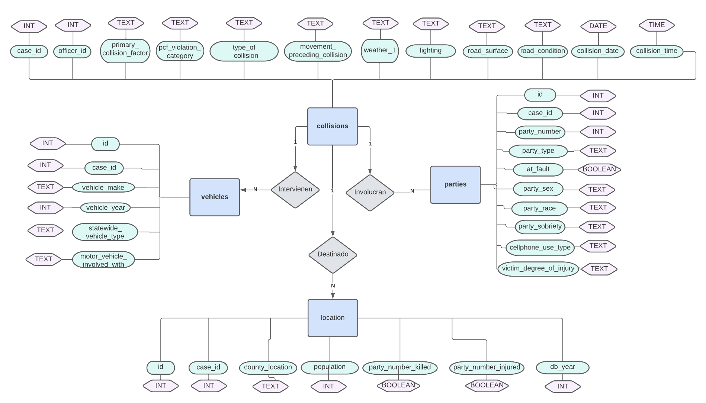

<!-- Tarea 2. Modelo e-r-->

# T2. Modelo e-r
### Instrucciones
[8 puntos] Convierte tu base de datos no estructurada en un modelo entidad-relación, representándolo con un diagrama entidad-relación. Usa nodos con figuras correctas y aristas claramente señaladas con los números correspondientes para las relaciones.

[2 punto] Muestra el dominio de los atributos.

Subir esta descripción en un archivo markdown o PDF nombrado claramente (tarea 1 o algo por el estilo).

