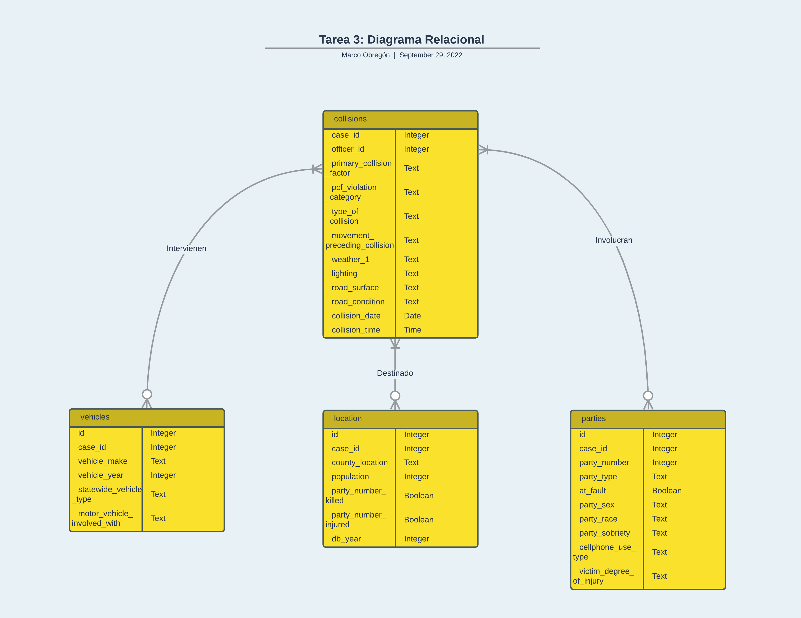

<!-- Tarea 3. Modelo Relacional-->

Instrucciones 

[3 puntos] Crea un esquema del modelo relacional de tu base de datos a partir del modelo e-r de la tarea anterior.


[3 puntos] Representa con un diagrama relacional tu esquema del punto anterior.


[4 puntos] Encuentra cuatro operaciones que vayas a usar en tu base de datos y exprésalas mediante operadores del álgebra relacional. Explica con tus propias palabras cada una de estas operaciones.


Reporta tu tarea de una manera claramente identificable en el repositorio.

----

# 3.- Modelo Relacional
## Esquema del Modelo Relacional
collisions(case_id, officer_id, primary_collision_factor,  pcf_violation_category,type_of_collision, movement_preceding_collision, weather_1, lighting, road_surface, collision_date, collision_time)

vehicles(id, case_id, vehicle_make, vehicle_year_, statewide_vehicle_type_, motor_vehicle_involved_with)

parties(id, case_id, party_number, party_type, at_fault, party_sex, party_race, party_sobriety, cellphone_use_type, victim_degree_of_injury)

location(id, case_id, country_location, population, party_number_killed, party_number_injured)

## Diagrama del Modelo Relacional





**Posible causas por accidente:**


Π case_id, pcf_violation_category (collisions)

```
collisions(case_id, pcf_violation_category)
```


 **Accidentes sobre el tiempo:**


Π case_id, collision_date (collisions)

```
collisions(case_id, collision_date)
```


**Accidentes donde el culpable utilizaba el celular:**


σ cellphone_use_type = "cellphone in use" and at_fault is true(parties)

```
parties[(cellphone_use_type = "cellphone in use") | (at_fault is true)]
```

**Accidentes que involucran bebidas alcolicas:**


σ party_sobriety = "had been drinking, under influence" and at_fault is true(parties)

```
parties[(party_sobriety = "had been drinking, under influence") | (at_fault is true) ]
```


 **Cuplables por sexo:**


Π party_sex, at_fault(parties)

```
parties(party_sex, at_fault)
```
